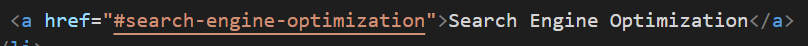
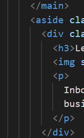
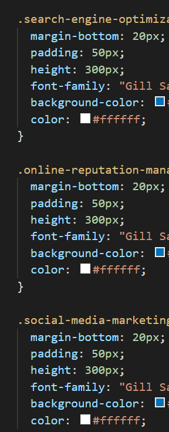
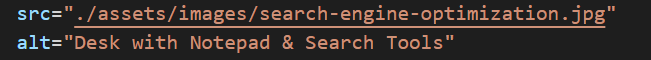
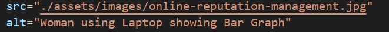
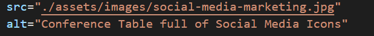

# 01 HTML, CSS, and Git: Code Refactor (Explanation ReadMe)

1. Cleaning up the code:

- A. Fixing Navigation bar links

  

- B. Fixing indentation

  

- C. Reordering styling sheet instruction

  

- D. Define page areas

  - i. "Header" = "header"
    - a. including "nav"
  - ii. "Content" = "main"
    - a. including "section"
  - iii. "Benefits" = "aside"
  - iv. "Footer" = "footer"

    

2. Adding Alternate display text to all the images
   (Except the background image)

   
   
   
